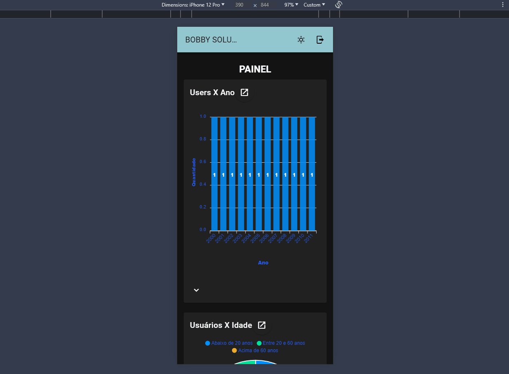

# teste-tecnico-front

## Descrição
Este repositório contém uma mini-aplicação para controle de usuários desenvolvida em Vue.js 3. A aplicação permite a criação, edição, exclusão e busca de usuários, além de outras funcionalidades para proporcionar maior fluidez, como autenticação (permitindo que apenas usuários autenticados realizem modificações), validação de formulários, feedbacks de erro, confirmação e informação.

Além do CRUD de usuários, foi desenvolvida uma tela de dashboard com gráficos, exibindo dados dos usuários cadastrados na aplicação.

Para simular o consumo de uma API real, foi utilizada a API [reqres.in](https://reqres.in/), que fornece todas as rotas necessárias para a aplicação, desde registro e login até exclusão. O CRUD foi realizado utilizando essa API, juntamente com Vuex, que possibilitou otimizar a aplicação, evitando requisições desnecessárias e mantendo os dados visualmente atualizados para o usuário.

Por se tratar de uma API fake, não é possível persistir os dados. Portanto, em caso de reload na aplicação, as informações voltarão ao padrão da API.

O deploy da aplicação foi realizado em um servidor ftp e se encontra em: http://andrerodriguescorreia.com.br:21203 (não possui ssl, em caso de erro verifique
se a url está sem o 's' no http)

### Tecnologias Utilizadas
- **Vue.js 3:** Apesar da sintaxe estar semelhante à do Vue.js 2, a versão utilizada para esse projeto foi a do Vue.js 3.
- **Vuetify:** Biblioteca de componentes UI.
- **ApexCharts:** Biblioteca para criação de gráficos interativos.

### Funcionalidades
- **Autenticação:** Implementação de um sistema de login para garantir acesso seguro às funcionalidades da aplicação.
- **Validação de Formulários:** Garantia de que todos os campos obrigatórios sejam preenchidos corretamente.
- **CRUD de Usuários:** Permite a criação, edição, exclusão e visualização de usuários.
- **Filtro de Busca:** Ferramenta para buscar usuários por nome.
- **Dashboard:** Exibição de indicadores e gráficos para análise dos dados dos usuários.

O layout é responsivo e funciona bem em dispositivos móveis.

## Configuração do Projeto
Versão do node utilizada: 18.16.0 (utilizar ela ou superior)
### Instalação

1. Clone o Repositório e entre na raiz do projeto
```
git clone https://github.com/Andre-Rodrigues-Correia/teste-tecnico-front.git
cd teste-tecnico-front
```
2. Instale as Dependências
```
npm install
```
3. Inicie o Servidor no modo de desenvolvimento

```
npm run serve
```
4. no terminal será exibido o endereço da aplicação, caso não tenha nenhuma outra aplicação em excução, normalmente
   o endereço sera `http://localhost:8080`

Para testar a aplicação, utilize os dados fornecidos pelo [reqres.in](https://reqres.in/).
Usuário para teste:
<br>e-mail: eve.holt@reqres.in
<br>senha: cityslicka

## Como foi resolver o teste ?
### Estrutura
Primeiramente, pensei em como estruturar o projeto de maneira organizada, que fosse fácil de manter e adicionar novas funcionalidades. Estruturei o projeto em quatro views principais: Registro de Usuário, Login, Dashboard e Usuários.

As views de Registro e Login são simples, com um formulário e suas devidas validações.

A view de Dashboard foi estruturada com um grid para permitir a exibição dos gráficos de maneira organizada. Para facilitar a replicação e manutenção dos gráficos, criei três componentes que formam um card de gráfico:

1. Componente Base: Recebe o layout e os dados a serem exibidos.
2. Componente de Dados: Consome, trata e fornece os dados para o componente base.
3. Componente Card: Possui o título do gráfico e o gráfico em si, configurado na view de Dashboard, passando apenas o título e o componente que consome os dados.

Na view de Usuários, criei uma v-data-table responsável por exibir os usuários e permitir ações de edição e exclusão. O maior desafio foi a alteração do estado dos usuários, pois, como foi utilizada uma API fake, os dados não são alterados no backend. Utilizei Vuex para o gerenciamento do estado da lista de usuários, garantindo que as requisições fossem feitas para a API corretamente e que as alterações fossem preservadas na aplicação.

Além das views, criei outros componentes, como Modal, Header, um formulário reutilizável para cadastro e edição de usuários, um Loader, entre outros, necessários para o correto funcionamento. Prezei pela criação apenas dos componentes necessários e pela sua reutilização de maneira correta.

Para permitir a navegação na aplicação, criei um navigation drawer e um Header, que permitem navegar entre as views, sair da aplicação e alterar o tema.

### Obeservações
- Apesar da sintaxe ser semelhante ao Vue.js 2, a versão utilizada é a 3.
- A paginação de usuários foi implementada na v-data-table de forma visual. Não foi consumida a API paginando, pois ao realizar alguma alteração de registro, ao paginar essas alterações se perdiam e o usuário não conseguiria visualizá-las. A v-data-table lista os usuários e possui uma quantidade de usuários exibidos por página e a possibilidade de mudança dessa quantidade.


# Telas e funcionalidades da aplicação

### Registro e login de usuários


### Navegação pela aplicação


### CRUD de usuários


### Responsividade


### Autenticação e segurança


Em relação aos testes, optei por não implementá-los nesta aplicação. Embora eu tenha experiência em implementar testes no backend, ainda estou estudando e aprendendo sobre testes no frontend.

Prefiri não incluir testes superficiais que poderiam não agregar valor real ao projeto. No entanto, reconheço plenamente a importância dos testes para manter a saúde de uma aplicação.